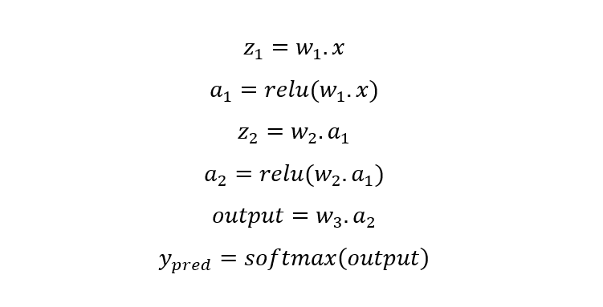
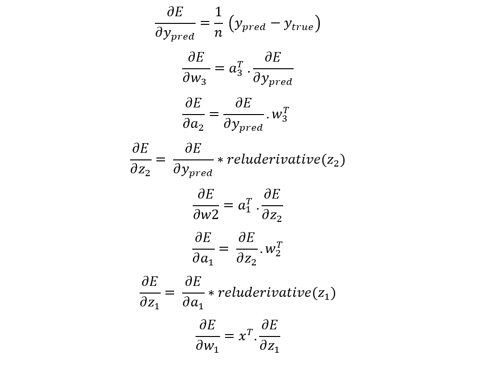
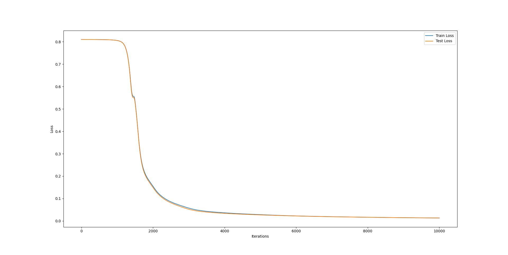

# MNIST

# Artificial Neural Network MNIST dataset

This project demonstrates the implementation of an Artificial Neural Network (ANN) for MNIST dataset recognition using Python, TensorFlow, and Numpy. The MNIST dataset consists of hand-written digits and is a standard benchmark in the field of deep learning.

## Overview

This project focuses on training an ANN to recognize and classify hand-written digits from the MNIST dataset. The primary steps involved are data preprocessing, model architecture setup, training, and evaluation.

## Prerequisites

Library in use:

- Python
- TensorFlow
- Numpy
- Pandas
- Matplotlib

## Dataset

The MNIST dataset is used for training and testing. It consists of 60,000 training samples and 10,000 testing samples, each of 28x28 pixel resolution.

# Code Structure

## forward propagatim

## back propagatio
        

## update weight

w -= learning_rate * dw

# Training

